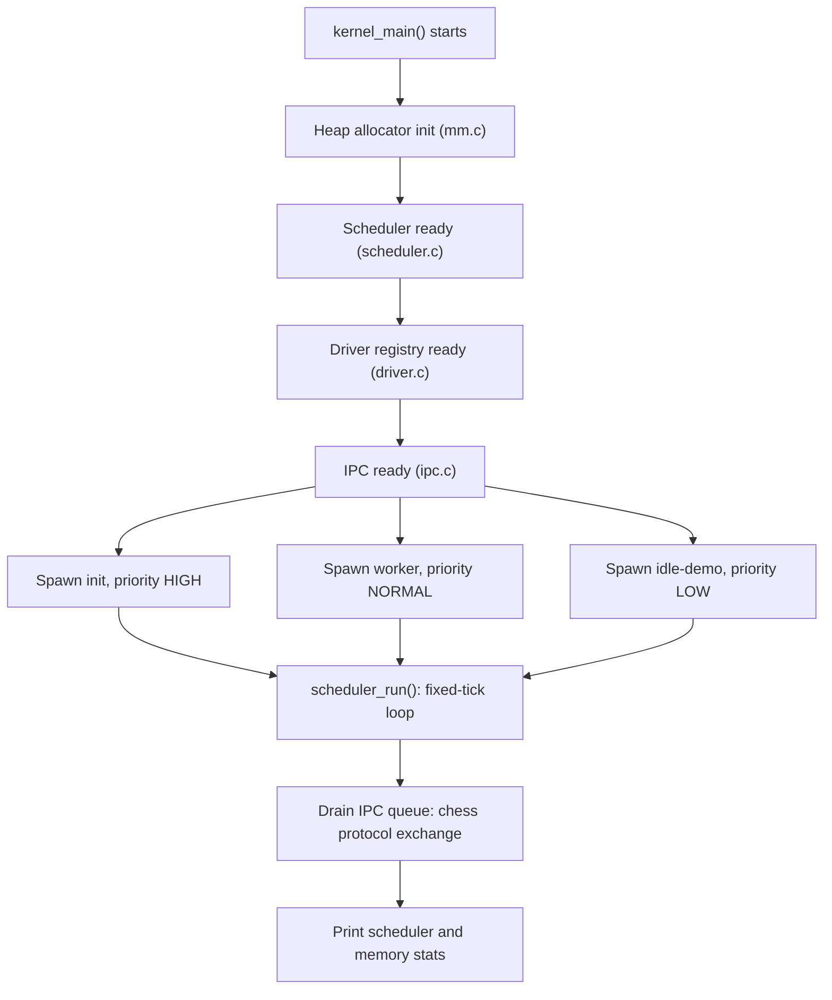

# pasinux

*A hobby x86 operating system kernel, moving from a hosted C simulator toward a real, freestanding, bootable kernel.*

[](LICENSE)
[](https://github.com/lekovicpavle13-lgtm/pasinux)
[](#roadmap)
[](#contributing)

## Table of Contents

- [Overview](#overview)
- [Subsystems](#subsystems)
  - [Memory Management](#memory-management)
  - [Process Scheduler](#process-scheduler)
  - [Driver Framework \& IPC](#driver-framework--ipc)
  - [Interrupts, Timer \& Keyboard](#interrupts-timer--keyboard)
  - [Boot Loader](#boot-loader)
- [Architecture](#architecture)
- [Project Structure](#project-structure)
- [Getting Started](#getting-started)
  - [Prerequisites](#prerequisites)
  - [Build](#build)
  - [Run](#run)
- [Known Issues](#known-issues)
- [Roadmap](#roadmap)
- [Contributing](#contributing)
- [License](#license)
- [Author](#author)

## Overview

pasinux is a hobby x86 operating system kernel written in C and NASM assembly. It's in the middle of a deliberate architectural transition: the core subsystems (memory management, scheduling, drivers, IPC) were originally designed and exercised as a hosted C program that ran like an ordinary userspace executable, so they could be built and debugged with everyday tools. The project has since grown a real freestanding side — a legacy BIOS boot sector, a linker script, an IDT with ISR/IRQ stubs, a PIT timer driver, and a PS/2 keyboard driver — aimed at eventually booting `pasinux` as an actual kernel under QEMU.

> Status: early-stage and under active development, with both build models currently present in the tree. See [Known Issues](#known-issues) for exactly where the hosted-C subsystems and the freestanding build currently disagree.

## Subsystems

### Memory Management

Implemented in `kernel/mm.c` / `kernel/mm.h`.

- A page-header-based heap allocator (`kmalloc`, `kcalloc`, `kfree`) with first-fit search and block splitting
- Allocation/free counters
- `mm.h` currently exposes a different, smaller API surface (heap bounds, allocation counters) than the one `mm.c` implements — see [Known Issues](#known-issues)

### Process Scheduler

Implemented in `kernel/scheduler.c` / `kernel/scheduler.h`.

- A ready queue with three priority levels: `LOW`, `NORMAL`, `HIGH`
- A process state machine: `READY`, `RUNNING`, `SLEEPING`, `ZOMBIE`
- A sleep/wakeup queue and configurable time-slice preemption
- A selectable scheduling policy (round-robin or strict priority)
- `process_exit()` and runtime statistics (context switches, idle vs. work time, created/terminated counts)

### Driver Framework & IPC

Implemented in `kernel/driver.c` / `kernel/driver.h` and `kernel/ipc.c` / `kernel/ipc.h`.

- A minimal driver registry (`driver_register`, `driver_lookup`) covering char, block, net, and input device types, with a common `driver_ops_t` interface
- A working console driver registered at boot
- A priority message queue (`msg_send` / `msg_recv`) for passing messages between processes
- A small chess protocol (moves, resignations, draw offers, board state) used as a realistic workload to exercise the queue end to end

### Interrupts, Timer & Keyboard

Implemented in `kernel/idt.c`, `kernel/isr.asm`, `kernel/timer.c`, `kernel/keyboard.c`, `kernel/port_io.h`.

- A 256-entry IDT with PIC remapping, plus NASM-generated ISR (0–31) and IRQ (32–47) stubs
- A programmable interval timer (PIT) driver generating a configurable tick rate
- A PS/2 keyboard driver with a scancode-to-ASCII table (including shift handling) and a circular input buffer
- Low-level port I/O helpers (`inb`/`outb`/`inw`/`outw`/`inl`/`outl`)

### Boot Loader

Implemented in `kernel/boot.asm`, `kernel/entry.asm`, `kernel/linker.ld`.

- A real-mode BIOS boot sector: enables the A20 line, loads the kernel image via LBA disk reads, and switches to protected mode
- A 32-bit entry stub (`entry.asm`) that sets up its own stack, zeroes `.bss`, and calls `kernel_main()`
- A linker script placing the kernel at the conventional 1 MiB load address, with a computed `_kernel_size` for the boot sector's disk-read loop

## Architecture

`kernel_main()` in `kernel.c` brings the subsystems up in a fixed order — heap, scheduler, drivers, then IPC — and creates three demo processes to put them to work:

1. `init` (high priority) sends a starting chess position and a move over IPC.
2. `worker` (normal priority) replies with a move of its own.
3. `idle-demo` (low priority) shows the scheduler falling back to idle when there's no work to do.

`scheduler_run()` then advances the scheduler for a fixed number of ticks, draining the IPC queue and printing scheduler and memory statistics once it completes.



Separately, on the freestanding side, `boot.asm` loads `kernel.bin` from disk and jumps to `entry.asm`'s `_start`, which zeroes `.bss` and calls the same `kernel_main()` — the intended path to booting this under QEMU once the two sides are reconciled (see [Known Issues](#known-issues)).

## Project Structure

```
pasinux/
├── LICENSE
├── README.md
└── kernel/
    ├── Makefile
    ├── README.md          # kernel-core build notes (currently describes the older hosted-simulator flow)
    ├── boot.asm           # real-mode BIOS boot sector: A20, LBA disk load, protected-mode switch
    ├── entry.asm           # 32-bit entry stub: stack setup, .bss zeroing, calls kernel_main()
    ├── isr.asm             # NASM-generated ISR/IRQ stubs
    ├── linker.ld           # linker script, 1 MiB load address
    ├── kernel.c            # kernel entry point / demo process setup
    ├── mm.c / mm.h         # heap allocator
    ├── scheduler.c / scheduler.h    # process scheduler
    ├── driver.c / driver.h         # driver registry + IPC message types
    ├── ipc.c / ipc.h               # IPC dispatch + chess protocol handlers
    ├── idt.c / idt.h               # IDT setup, PIC remap, interrupt dispatch
    ├── timer.c / timer.h           # PIT timer driver
    ├── keyboard.c / keyboard.h     # PS/2 keyboard driver
    └── port_io.h                    # inb/outb-style port I/O helpers
```

## Getting Started

### Prerequisites

- `gcc` (targeting `i386`/`elf32`; a multilib install is needed on an x86_64 host — e.g. `gcc-multilib` on Debian/Ubuntu)
- `nasm`
- GNU binutils (`ld`, `objcopy`)
- `qemu-system-i386` (for `make run`)
- `make`

### Build

```bash
cd kernel
make
```

This assembles `entry.asm` and `isr.asm`, compiles the C sources with `-m32 -ffreestanding -nostdlib -nostdinc`, links them against `linker.ld` into `build/kernel.elf`, converts that to a flat `build/kernel.bin`, patches the sector count into `boot.asm`, assembles the boot sector, and concatenates everything into `build/disk.img`.

As noted in [Known Issues](#known-issues), several of the C sources still call hosted libc functions (`printf`, `getchar`, `fwrite`) that aren't available under `-nostdinc -nostdlib`, so a clean `make` currently fails at the compile step for those files.

### Run

```bash
make run
```

Boots `build/disk.img` in `qemu-system-i386` once it builds successfully.

```bash
make clean
```

Removes the `build/` directory.

## Known Issues

The tree currently mixes an older hosted-C design with a newer freestanding one, and a few rough edges from that transition are still visible. Flagging them here rather than glossing over them, since fixing any one of these is a reasonable, self-contained first contribution:

- **`mm.c` / `mm.h` are out of sync.** `mm.h` declares heap bounds and counters that `mm.c` doesn't use, while `mm.c` defines its own `heap_start`/`heap_end` with a conflicting type and doesn't declare `kmalloc`/`kcalloc`/`kfree`/`init_memory` in the header at all. `coalesce_free_blocks()` and `heap_expand()` are currently stubs, and there's no `krealloc`.
- **Hosted libc calls under a freestanding build.** `kernel.c`, `driver.c`, and `scheduler.c` call `printf`, `getchar`, and `fwrite`, but the Makefile compiles with `-ffreestanding -nostdlib -nostdinc`, which has no standard headers or C library to link against. These will need a minimal freestanding console/VGA writer in place of `<stdio.h>`.
- **Duplicate `Makefile` target.** `kernel/Makefile` defines `C_SOURCES`, `C_OBJECTS`, and the `$(KERNEL_BIN)` rule twice (once for the base sources, once adding `idt.c timer.c keyboard.c` with the ISR object). GNU Make merges the prerequisites and keeps the second recipe, so this likely still builds, but it's worth collapsing into a single rule.
- **Stray file-scope statements in `keyboard.c`.** A handful of call-like statements (`idt_init(); timer_init(100); keyboard_init(); asm volatile ("sti");`) sit between the global variable declarations and the function definitions, outside of any function body — these need to move into an actual init routine.
- **Build artifacts committed to the repository.** `kernel/*.o` and `kernel/*.exe` are currently tracked in git. The `.gitignore` in this repo now excludes them going forward; existing ones can be dropped from version control with:
  ```bash
  git rm --cached kernel/*.o kernel/*.exe
  git commit -m "Stop tracking build artifacts"
  ```

## Roadmap

- [x] Heap allocator skeleton with first-fit search and block splitting
- [x] Scheduler with sleep/wakeup, time-slice preemption, and a selectable priority policy
- [x] Driver registry, console driver, and a priority IPC queue
- [x] Real-mode boot sector: A20 enable, LBA disk load, protected-mode entry
- [x] IDT, ISR/IRQ stubs, PIC remap
- [x] PIT timer driver
- [x] PS/2 keyboard driver
- [ ] Reconcile the hosted C subsystems with the freestanding build (see [Known Issues](#known-issues))
- [ ] VGA text-mode output for a freestanding console driver
- [ ] Finish the heap allocator: coalescing, heap growth, `krealloc`
- [ ] First successful end-to-end boot of `disk.img` in QEMU

## Contributing

pasinux is a hobby project and still early, which makes it a reasonable place to get hands-on kernel development experience. Contributions, bug reports, and questions are all welcome.

- The [Known Issues](#known-issues) section lists several self-contained starting points.
- For anything larger than a small fix, open an issue first to discuss the approach.
- Keep C sources building cleanly under `-Wall -Wextra` at minimum.

## License

Distributed under the MIT License. See [LICENSE](LICENSE) for the full text.

## Author

[lekovicpavle13-lgtm](https://github.com/lekovicpavle13-lgtm)
