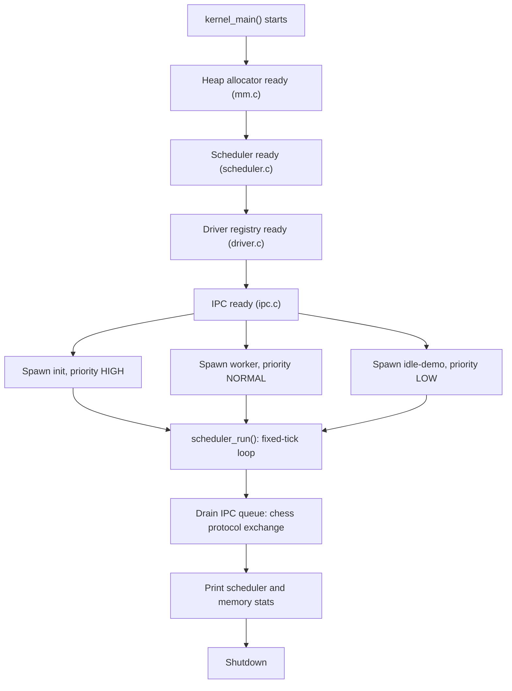

# pasinux

*A hobby x86_64 operating system kernel, built and tested as a userspace simulator before it grows into a real, freestanding, bootable kernel.*

[](LICENSE)
[](https://github.com/lekovicpavle13-lgtm/pasinux)
[](#roadmap)
[](https://github.com/lekovicpavle13-lgtm/pasinux/stargazers)
[](#contributing)

## Table of Contents

- [Overview](#overview)
- [Features](#features)
  - [Memory Management](#memory-management)
  - [Process Scheduler](#process-scheduler)
  - [Driver Framework](#driver-framework)
  - [Inter-Process Communication](#inter-process-communication)
  - [Boot Sector](#boot-sector)
- [Architecture](#architecture)
- [Project Structure](#project-structure)
- [Getting Started](#getting-started)
  - [Prerequisites](#prerequisites)
  - [Build](#build)
  - [Run](#run)
  - [Other Make Targets](#other-make-targets)
- [Example Output](#example-output)
- [Roadmap](#roadmap)
- [Continuous Integration](#continuous-integration)
- [Contributing](#contributing)
- [License](#license)
- [Author](#author)

## Overview

pasinux is a hobby x86_64 operating system kernel written in C and hand-written assembly. Instead of targeting bare metal from day one, each subsystem - memory management, process scheduling, device drivers, and inter-process communication - is designed, built, and exercised first as a hosted C program that runs like an ordinary userspace application. Once a subsystem holds up in the simulator, it becomes part of the path toward a real, freestanding, bootable kernel.

Because the current build target is a normal executable (`kernel_sim`), the kernel logic compiles with a stock `gcc` invocation and can be run, inspected, and debugged with everyday tools instead of requiring an emulator or real hardware at every step. A legacy BIOS boot sector (`boot.asm`) already exists in the repository as a valid placeholder, reserved for the point where the project moves onto real hardware.

> Status: early-stage and under active development. The C sources build and run today as a userspace simulator (`kernel_sim`); the boot sector is a valid placeholder that is not yet wired into the build.

## Features

### Memory Management

Implemented in `mm.c` / `mm.h`.

- A real heap allocator over a static 1 MiB arena
- First-fit allocation search
- 16-byte aligned blocks
- Block splitting when a larger free block is allocated
- Coalescing of adjacent free blocks on `free`
- A familiar allocator API: `kmalloc`, `kcalloc`, `krealloc`, `kfree`
- Live statistics: current and peak usage, plus allocation, free, and failure counts

### Process Scheduler

Implemented in `scheduler.c` / `scheduler.h`.

- A circular ready queue with three priority levels: `LOW`, `NORMAL`, `HIGH`
- A full process state machine: `READY`, `RUNNING`, `SLEEPING`, `ZOMBIE`
- A sleep and wakeup queue
- Configurable time-slice preemption
- A selectable scheduling policy: round-robin or strict priority
- `process_exit()` for clean process termination
- Runtime statistics: context switches, idle vs. work time, and created/terminated process counts

### Driver Framework

Implemented in `driver.c` / `driver.h`.

- A minimal driver registry covering char, block, net, and input device types
- A common `driver_ops_t` interface implemented by every driver
- A working console driver already wired in at boot

### Inter-Process Communication

Implemented in `ipc.c` / `ipc.h`.

- A priority message queue for passing messages between processes
- A small chess protocol - moves, resignations, draw offers, board state - used as a realistic workload to exercise the queue end to end

### Boot Sector

Implemented in `boot.asm`.

- A valid legacy BIOS boot sector, already written
- Not yet wired into the build; reserved for the freestanding kernel milestone

## Architecture

`kernel_main()` in `kernel.c` brings the subsystems up in a fixed order - heap, scheduler, drivers, then IPC - and creates three demo processes to put them to work:

1. `init` (high priority) sends a starting chess position and a move over IPC.
2. `worker` (normal priority) replies with a move of its own.
3. `idle-demo` (low priority) shows the scheduler falling back to idle when there is no work to do.

`scheduler_run()` then advances the scheduler for a fixed number of ticks. Each tick advances the sleep queue, preempts the running process once its time slice is spent, and picks the next process according to whichever policy is active - round-robin by default, or strict priority under the alternate policy. Once the run completes, queued IPC messages are drained, and final scheduler and memory statistics are printed.



## Project Structure

```
pasinux/
├── .github/workflows/c-cpp.yml   # CI workflow
├── .gitignore
├── LICENSE
├── operator-handoff.md           # project status and roadmap notes
└── pasinux/
    ├── operator-handoff.md       # kernel-core status notes
    └── kernel/
        ├── boot.asm                     # legacy BIOS boot sector (placeholder)
        ├── kernel.c                     # kernel entry point / demo process setup
        ├── mm.c / mm.h                  # heap allocator
        ├── scheduler.c / scheduler.h    # process scheduler
        ├── driver.c / driver.h          # driver registry + IPC message types
        ├── ipc.c / ipc.h                # IPC dispatch + chess protocol handlers
        ├── Makefile
        └── README.md                    # kernel-core build notes
```

## Getting Started

### Prerequisites

- A C compiler with C11 support (`gcc` is used throughout this document)
- `make`

### Build

```bash
cd pasinux/kernel
make
```

Or invoke `gcc` directly:

```bash
gcc -std=c11 -Wall -Wextra -Wpedantic -g -o kernel_sim kernel.c mm.c scheduler.c driver.c ipc.c
```

### Run

```bash
make run
```

This smoke-runs the simulator: it initializes memory, the scheduler, drivers, and IPC, spawns an `init` and a `worker` process, exchanges chess-protocol messages over IPC, drains the queue, and prints scheduler and memory statistics.

### Other Make Targets

```bash
make syntax   # syntax-check all sources without building
make clean    # remove build artifacts
```

## Example Output

```
[KERNEL] pasinux kernel core starting
[MM] heap ready: 1048576 bytes
[SCHED] scheduler ready
[DRIVER] registered console
[DRIVER] driver core ready
[IPC] ipc ready
[SCHED] created init pid=1 priority=10
[SCHED] created worker pid=2 priority=5
[SCHED] created idle-demo pid=3 priority=1
...
[IPC] chess move from pid=1 to pid=1: e2e4 promotion=0 score=-49
[SCHED] ticks=8 switches=8 created=3 terminated=0 idle=0 work=8
[MM] allocations=6 frees=0 current=12672 peak=12672 failed=0
[KERNEL] shutdown complete
```

## Roadmap

- [x] Heap allocator with splitting and coalescing (`kmalloc` / `kcalloc` / `krealloc` / `kfree`)
- [x] Scheduler with sleep/wakeup, time-slice preemption, and a selectable priority policy
- [ ] VGA text-mode driver
- [ ] Interrupt handlers
- [ ] Wire `boot.asm` into a freestanding build, with QEMU-based testing
- [ ] Bring the CI workflow in line with the actual `Makefile` (see [Continuous Integration](#continuous-integration))

## Continuous Integration

`.github/workflows/c-cpp.yml` currently runs an Autotools-style pipeline: `./configure`, `make`, `make check`, `make distcheck`. The kernel currently ships a plain `Makefile` with no `configure` script and no `check` or `distcheck` targets, so the workflow does not pass as committed. Bringing it in line with the real build - either by adding Autotools scaffolding or simplifying the workflow to `make` / `make run` - is an open, self-contained task and a reasonable place to make a first contribution.

## Contributing

pasinux is a hobby project and still early, which makes it a reasonable place to get hands-on kernel development experience. Contributions, bug reports, and questions are all welcome.

- Check the [Roadmap](#roadmap) for open items, or the [Continuous Integration](#continuous-integration) note above for a self-contained first task.
- For anything larger than a small fix, open an issue first to discuss the approach.
- Keep the code building cleanly under `-Wall -Wextra -Wpedantic` (see [Build](#build)).

## License

Distributed under the MIT License. See [LICENSE](LICENSE) for the full text.

## Author

[lekovicpavle13-lgtm](https://github.com/lekovicpavle13-lgtm)
