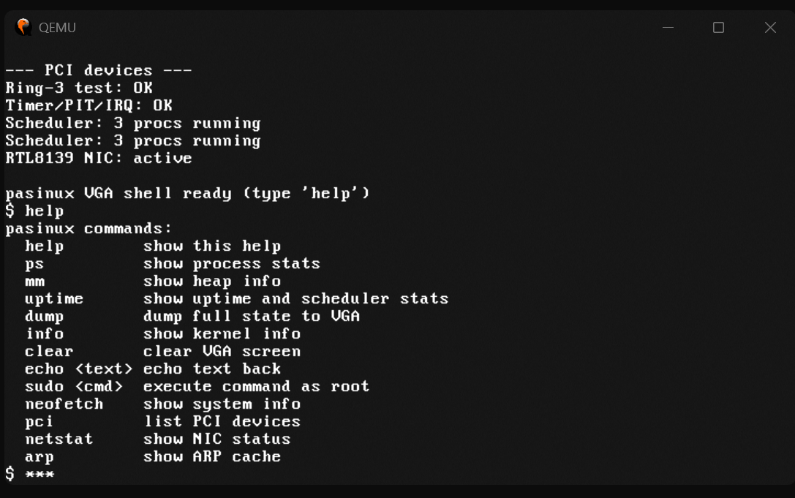
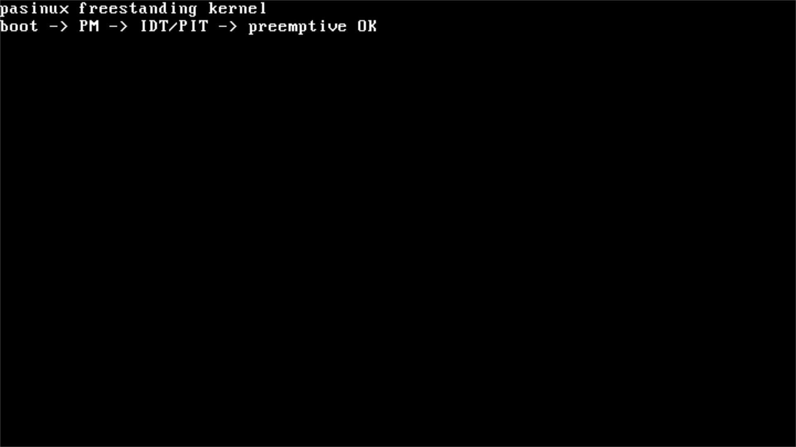

# pasinux — hobby x86 OS kernel

**A from-scratch x86 kernel in C and assembly — built two ways: a fast hosted userspace simulator for iterating on kernel logic, and a real freestanding kernel that boots, runs preemptively, and talks to the network in QEMU.**

[](LICENSE)




> **Status:** pasinux now exists in two working forms. The **hosted simulator** (`kernel_sim`) runs the memory manager, scheduler, driver registry, and IPC layer as an ordinary userspace program on any POSIX-like host — good for fast iteration without touching real hardware state. The **freestanding kernel** (`kernel.pe` → `pasinux.img`) is the real thing: a 32-bit protected-mode x86 kernel with its own boot sector, GDT/IDT/TSS, paging, a PIT-driven preemptive scheduler, PCI + RTL8139 networking, and an interactive VGA shell — and it boots successfully in QEMU today, complete with PCI enumeration, ring-3 usermode, and a live NIC (see screenshot above).

---

## Table of contents

- [Then vs. now](#then-vs-now)
- [Two ways to run pasinux](#two-ways-to-run-pasinux)
- [Features](#features)
- [Project structure](#project-structure)
- [Getting started](#getting-started)
- [The interactive VGA shell](#the-interactive-vga-shell)
- [Boot process (freestanding kernel)](#boot-process-freestanding-kernel)
- [Architecture (hosted simulator)](#architecture-hosted-simulator)
- [CI](#ci)
- [Roadmap](#roadmap)
- [License](#license)
- [Author](#author)

---

## Then vs. now

pasinux started as a boot sector that could barely prove it was alive, and has grown into a kernel with a real driver stack, networking, and an interactive shell.

| Early boot — protected mode + preemption confirmed | Today — VGA shell, PCI, ring-3, and a live NIC |
|:---:|:---:|
|  |  |
| `boot -> PM -> IDT/PIT -> preemptive OK` | `pasinux VGA shell ready` — PCI devices enumerated, ring-3 test passed, scheduler running 3 procs, RTL8139 NIC active |

---

## Two ways to run pasinux

| | Hosted simulator | Freestanding kernel |
|---|---|---|
| Binary | `kernel_sim` (+ `kernel_gui.exe`) | `kernel.pe` → `pasinux.img` |
| Runs on | Any host with `gcc` | QEMU (`qemu-system-i386`) or real x86 hardware via floppy image |
| Purpose | Fast iteration on core kernel logic | The real kernel: boot sector, protected mode, interrupts, paging, drivers |
| Toolchain | `gcc`, `make` | + `nasm`, `python3`, a MinGW-style `ld`, `qemu-system-i386` |

Both editions share the same design for memory management, scheduling, and IPC — the hosted version proves the logic out; the freestanding version runs it under real interrupts, real paging, and real hardware I/O.

---

## Features

### Memory management (`mm/mm.c` hosted, `mm/mm_fs.c` freestanding)
A freelist-based heap allocator over a static 1 MiB arena, with no dependency on the host's `malloc`:

| Aspect | Behavior |
|---|---|
| Arena size | Static 1 MiB |
| Search strategy | First-fit |
| Alignment | 16-byte aligned blocks |
| Allocation | Splits blocks when a free block is larger than requested |
| Deallocation | Coalesces adjacent free blocks |
| API | `kmalloc`, `kcalloc`, `krealloc`, `kfree` |
| Observability | Current/peak usage, allocation/free/failure counters |

### Process scheduling (`sched/scheduler.c` hosted, `sched/sched_fs.c` freestanding)
- **Hosted:** a circular ready queue with three priority tiers (`LOW`/`NORMAL`/`HIGH`), process states (`READY`/`RUNNING`/`SLEEPING`/`ZOMBIE`), a sleep/wakeup queue, configurable time-slice preemption, and a selectable round-robin or strict-priority policy.
- **Freestanding:** a genuinely preemptive round-robin scheduler driven by real hardware interrupts — the PIT timer IRQ calls `sched_fs_on_tick()` to count down a process's time slice, and the shared ISR return path calls `sched_fs_maybe_switch()` to swap the saved register frame (and `CR3`, if the process has its own address space). Note: the freestanding scheduler currently ignores the priority argument passed to `sched_fs_create_process()` — every process gets equal round-robin time, unlike the hosted version's priority tiers.

### CPU / architecture layer (`arch/`, freestanding only)
The part that doesn't exist in the hosted build — real x86 protected-mode plumbing:

- **GDT** (`gdt.c/h`) — 6 entries: kernel code/data, user code/data, and a TSS descriptor, giving ring 0 and ring 3 segments.
- **TSS** (`tss.c/h`) — used for the `esp0` kernel-stack switch on ring 3 → ring 0 transitions.
- **IDT** (`idt.c/h`, `isr.asm`) — 256 entries, with 48 ISR stubs wired to real handlers and a dedicated `INT 0x80` syscall gate installed at DPL 3 as a trap gate.
- **PIC remap + IRQ dispatch** (`interrupt.c/h`) — a handler table so drivers (timer, keyboard, RTL8139) register their own IRQ callbacks.
- **Paging** (`paging.c/h`) — identity-maps the first 4 MiB and mirrors it at the higher half (`0xC0000000`); the kernel runs at the higher-half virtual address after `entry.asm` enables paging and flushes the identity mapping. `paging_create_pd()` exists for building additional page directories, but per-process address-space isolation isn't wired into process creation yet.
- **Syscalls** (`syscall.c/h`) — a minimal ABI over `INT 0x80`: `SYS_PRINT`, `SYS_EXIT`, `SYS_GETTIME`.
- **Ring-3 usermode** (`user/user_start.asm`) — `kmain()` allocates a kernel stack and a user stack, then calls `launch_ring3()` to actually drop into CPL 3 code, round-tripping through the GDT/TSS/syscall path.

### Driver framework (`drivers/driver.c` hosted, `drivers/driver_fs.c` freestanding)
A device registry decoupling subsystem code from concrete implementations, supporting `char`, `block`, `net`, and `input` device classes behind a common `driver_ops_t` interface. The freestanding build registers real drivers:

- **Serial** (`serial.c/h`) — COM1 at 115200 baud, used as the primary boot/debug log.
- **VGA** (`vga.c/h`) — 80×25 text mode, with cursor control and a read-back self-test at boot.
- **PS/2 keyboard** (`keyboard.c/h`) — line-buffered input for the interactive shell.
- **PIT timer** (`timer.c/h`) — 100 Hz tick, the heartbeat for both timekeeping and scheduler preemption.
- **PCI** (`pci.c/h`) — config-space read/write, BAR decoding, bus-mastering enable, IRQ-line lookup, and a full bus scan at boot.
- **RTL8139 NIC** (`rtl8139.c/h`) — TX/RX descriptor rings, an IRQ handler, and packet/byte counters; auto-detected via the PCI scan.

### Networking (`net/`, freestanding only)
Brought up automatically at boot if an RTL8139 is found on the PCI bus:

- **Ethernet** framing (`net_eth.c/h`)
- **ARP** (`net_arp.c/h`) with a printable cache
- **IPv4** (`net_ip.c/h`)
- **TCP** (`net_tcp.c/h`) — a small client state machine (`CLOSED → SYN_SENT → ESTABLISHED → FIN_WAIT_1 → TIME_WAIT`) with a retransmit timer and blocking connect/send/recv
- **HTTP/1.1 client** (`http.c/h`) built on top of the TCP stack
- **JSON serializer** (`json.c/h`) — builds JSON into a fixed buffer; this is a writer, not a parser

### IPC (`ipc/ipc.c` hosted, part of `driver_fs.c` freestanding)
A priority message queue between processes, exercised end-to-end with a small **chess protocol** — moves, resignations, draw offers/accepts, and board-state messages.

### The interactive VGA shell
Once the freestanding kernel finishes booting, it drops into a command shell rendered to the VGA text console and driven by the PS/2 keyboard. See [below](#the-interactive-vga-shell) for the command list.

### Win32 GUI control panel (`gui/gui_main.c`, hosted only)
An optional native Win32 window (`kernel_gui.exe`) wraps the hosted simulator so you can step or run the scheduler, reset state, dump state, spawn processes, and drive the chess-protocol IPC demo (move, draw offer/accept, resign) with buttons instead of only reading console output.

### Boot sector (`boot/boot.asm`)
A real (no longer placeholder) legacy BIOS boot sector: sets up segments, prints a status message to VGA and serial, loads the kernel image from disk via `INT 0x13`, enables the A20 gate, installs a minimal 3-entry GDT, and switches to 32-bit protected mode before jumping into `entry.asm`.

### CI (`.github/workflows/`)
GitHub Actions scaffolding exists but doesn't yet match the real build — see [CI](#ci) below.

---

## Project structure

```
pasinux/
├── .github/workflows/         # CI scaffold (needs alignment — see CI section)
├── LICENSE                    # MIT License
├── .gitignore
├── asssets/                    # Screenshots used in this README
│   ├── old_qemu-boot.png       #   Early boot: PM/IDT/PIT/preemptive check
│   └── new_qemu_boot.png       #   Current: full VGA shell, PCI, ring-3, NIC
│
└── pasinux/kernel/
    ├── Makefile                # Hosted, GUI, sanitizer, and freestanding image/QEMU targets
    │
    ├── boot/                   # Boot sector + image packaging
    │   ├── boot.asm            #   16-bit BIOS boot sector -> protected mode
    │   ├── entry.asm           #   32-bit entry: zero BSS, page tables, higher-half jump
    │   ├── linker.ld           #   PE linker script (image base 0x10000)
    │   ├── mkimage.py          #   Flattens kernel.pe + boot.bin into a floppy image
    │   └── _check_pe.py        #   PE image sanity checker
    │
    ├── kernel/                 # Kernel entry points
    │   ├── kernel.c            #   Hosted simulator entry / demo process setup
    │   ├── kmain.c             #   Freestanding entry — full subsystem bring-up + VGA shell
    │   ├── kernel.h
    │   └── types.h
    │
    ├── arch/                   # CPU-level infrastructure (freestanding only)
    │   ├── gdt.c/h              #   Global Descriptor Table (6 entries)
    │   ├── idt.c/h              #   Interrupt Descriptor Table (256 entries, 48 ISRs)
    │   ├── interrupt.c/h        #   PIC remap + IRQ dispatch table
    │   ├── paging.c/h           #   Identity + higher-half paging
    │   ├── tss.c/h              #   Task State Segment (ring0/ring3 stack switch)
    │   ├── syscall.c/h          #   INT 0x80 syscall ABI
    │   ├── isr.asm              #   ISR stubs + scheduler-switch hook
    │   └── io.h                 #   Port I/O helpers
    │
    ├── mm/                      # Memory management
    │   ├── mm.c/h               #   Heap allocator (hosted)
    │   └── mm_fs.c/h            #   Heap allocator (freestanding)
    │
    ├── sched/                   # Process scheduling
    │   ├── scheduler.c/h        #   Priority scheduler (hosted)
    │   └── sched_fs.c/h         #   PIT-driven preemptive scheduler (freestanding)
    │
    ├── ipc/                     # Inter-process communication
    │   └── ipc.c/h              #   Message queue + chess protocol (hosted)
    │
    ├── drivers/                 # Device drivers
    │   ├── driver.c/h           #   Driver registry (hosted)
    │   ├── driver_fs.c/h        #   Driver registry + IPC/chess (freestanding)
    │   ├── serial.c/h           #   COM1 serial port
    │   ├── vga.c/h              #   VGA text mode (80x25) + shell rendering
    │   ├── keyboard.c/h         #   PS/2 keyboard
    │   ├── timer.c/h            #   PIT timer (100 Hz), drives scheduler ticks
    │   ├── pci.c/h              #   PCI bus enumeration
    │   └── rtl8139.c/h          #   RTL8139 network card driver
    │
    ├── net/                     # Networking stack (freestanding)
    │   ├── net_eth.c/h          #   Ethernet framing
    │   ├── net_arp.c/h          #   ARP + cache
    │   ├── net_ip.c/h           #   IPv4
    │   ├── net_tcp.c/h          #   TCP client state machine
    │   ├── http.c/h             #   HTTP/1.1 client
    │   └── json.c/h             #   JSON serializer
    │
    ├── gui/                     # Win32 operator GUI (hosted only)
    │   └── gui_main.c/h
    │
    └── user/                    # Ring-3 usermode support
        └── user_start.asm
```

---

## Getting started

### Prerequisites

- **gcc** with C11 support, **make** — for the hosted simulator, GUI, and sanitizer builds
- **nasm**, **python3**, a MinGW-style `ld` (`ld -m i386pe`), and **qemu-system-i386** — for the freestanding image + QEMU boot
- A MinGW/Windows toolchain — for the Win32 GUI build (links `gdi32`, `user32`, `comctl32`, `comdlg32`)

### Build & run the hosted simulator

```sh
cd pasinux/kernel
make          # builds kernel_sim
make run      # runs the smoke-test demo
```

Or invoke gcc directly:

```sh
gcc -std=c11 -Wall -Wextra -Wpedantic -g \
    -Iboot -Iarch -Imm -Isched -Idrivers -Inet -Iipc -Ikernel -Iuser -Igui \
    -o kernel_sim \
    kernel/kernel.c mm/mm.c sched/scheduler.c drivers/driver.c ipc/ipc.c
```

### Build & run the Win32 GUI

```sh
make gui        # builds kernel_gui.exe (requires MinGW / Windows)
make run-gui
```

### Build with sanitizers

```sh
make sanitize          # builds kernel_sim_san (ASan + UBSan)
./kernel_sim_san
```

### Build & boot the real freestanding kernel

```sh
make image      # kernel.pe -> kernel.bin -> pasinux.img (floppy image)
make qemu        # boots pasinux.img in QEMU: SDL display + serial on stdio
```

Other QEMU targets, depending on what you want to see:

| Target | Display | Serial | Notes |
|---|---|---|---|
| `make qemu` | SDL | stdio | default |
| `make qemu-vga` | SDL, forces standard VGA | — | for VGA-specific debugging |
| `make qemu-sdl` | SDL | — | display only |
| `make qemu-debug` | SDL | file (`qemu_serial.txt`) | also logs `cpu_reset,int,guest_errors` to `qemu_dbiginf.txt` |
| `make qemu-headless` | none | stdio | scriptable / CI-friendly |
| `make qemu-serial` | none | stdio | keeps the QEMU monitor |

### Other targets

```sh
make syntax     # syntax-check the hosted sources only
make clean      # remove all build artifacts (hosted, GUI, sanitizer, freestanding, image)
```

---

## The interactive VGA shell

Once the freestanding kernel finishes its boot sequence, it drops straight into a small command shell rendered on the VGA text console and driven by the PS/2 keyboard:

| Command | What it does |
|---|---|
| `help` | List available commands |
| `ps` | Current process name + context-switch/tick counts |
| `mm` | Heap stats — allocations, frees, current/peak usage, failures |
| `uptime` | Uptime in seconds and raw ticks, plus scheduler tick/switch counts |
| `dump` | `uptime` + `ps` combined |
| `info` | Kernel version, PIT rate, scheduler type, and the list of registered drivers |
| `clear` | Clear the VGA screen |
| `echo <text>` | Echo text back |
| `sudo <cmd>` | Runs another command with a "root" banner (no real privilege separation yet) |
| `neofetch` | ASCII banner + a `neofetch`-style system summary |
| `pci` | Re-run the PCI bus scan |
| `netstat` | RTL8139 status — I/O base, packet count, byte count |
| `arp` | Print the ARP cache (output goes to the serial console) |

---

## Boot process (freestanding kernel)

1. **BIOS boot sector** (`boot/boot.asm`, 16-bit, 512 bytes, loaded at `0x7C00`) — sets up segments, prints a boot message to VGA and serial, loads 100 sectors of the kernel image from disk via `INT 0x13`, enables the A20 line, installs a minimal 3-entry GDT, and switches to 32-bit protected mode.
2. It jumps to **`entry.asm`**'s `_start`, loaded at physical `0x10000` by the flattened image `boot/mkimage.py` builds.
3. `entry.asm` zeroes `.bss` (while still using physical addresses), builds a page directory/table identity-mapping the first 4 MiB and mirroring it at the higher half (`0xC0000000`), enables paging, and jumps to the higher-half virtual address of `kmain`. It then clears the now-unneeded identity mapping and flushes the TLB.
4. **`kmain()`** (`kernel/kmain.c`) brings subsystems up in order: serial console → VGA text mode (with a read-back self-test) → confirms higher-half paging is active → heap → GDT (6 entries) → TSS → IDT (256 entries, 48 ISR stubs, `INT 0x80` syscall gate) → IRQ handler table → scheduler → driver registry → PCI bus scan.
5. A **ring-3 demo** allocates a kernel stack and a user stack, then calls `launch_ring3()` to actually execute `user_start.asm` at CPL 3 — exercising the GDT/TSS/syscall path end to end.
6. A **PIT heartbeat check** busy-waits for a few intervals and confirms `timer_ticks()` is actually advancing, i.e. that the PIT + IRQ0 path is alive.
7. If an **RTL8139** is found on the PCI bus, it's initialized and the Ethernet/ARP/TCP stack comes up on top of it.
8. Three demo background processes (`init`, `worker`, `idle-demo`) are created on the freestanding scheduler.
9. Control passes to the **interactive VGA shell**.

---

## Architecture (hosted simulator)

`kernel_run_demo()` in `kernel/kernel.c` brings subsystems up in a fixed order and exercises them with a small demo workload:

1. **Heap** is initialized over a static 1 MiB arena.
2. **Scheduler** is initialized with an empty ready queue.
3. **Drivers** are registered — currently a console driver.
4. **IPC** is initialized.
5. **Three demo processes** are created:
   - `init` (high priority) — sends a chess starting position and a move over IPC.
   - `worker` (normal priority) — replies with a move.
   - `idle-demo` (low priority) — shows the scheduler falling back to idle when there's no work.
6. `scheduler_run(8)` advances the scheduler for 8 ticks: ticking the sleep queue, preempting the running process once its time slice is spent, and selecting the next process (round-robin by default, or strict priority under the alternate policy).
7. IPC messages queued during the run are drained.
8. Final scheduler and memory statistics are printed before shutdown.

### Sample output

```
[KERNEL] pasinux kernel core starting
[MM] heap ready: 1048576 bytes
[SCHED] scheduler ready
[DRIVER] registered console
[DRIVER] driver core ready
[IPC] ipc ready
[SCHED] created init pid=1 priority=10
[SCHED] created worker pid=2 priority=5
[SCHED] created idle-demo pid=3 priority=1
...
[IPC] chess move from pid=1 to pid=1: e2e4 promotion=0 score=-49
[SCHED] ticks=8 switches=8 created=3 terminated=0 idle=0 work=8
[MM] allocations=6 frees=0 current=12672 peak=12672 failed=0
[KERNEL] shutdown complete
```

---

## CI

The `.github/workflows/` directory contains a placeholder GitHub Actions workflow that currently runs an Autotools-style pipeline (`./configure`, `make check`, `make distcheck`). The project uses a plain `Makefile` with no `configure` script and no `check`/`distcheck` targets, so the workflow won't pass CI as committed — either add Autotools scaffolding or simplify the workflow to the real targets (`make`, `make run`, `make syntax`, `make image`, `make qemu-headless`). Tracked in the [Roadmap](#roadmap).

---

## Roadmap

- [x] Heap allocator — first-fit, splitting, coalescing, live stats (hosted + freestanding)
- [x] Process scheduler — priority tiers, sleep/wakeup, runtime stats (hosted); real PIT-driven preemption (freestanding)
- [x] VGA text-mode driver + interactive shell
- [x] Interrupt handling — GDT, TSS, IDT (256 entries / 48 ISRs), PIC remap, PIT @ 100 Hz, PS/2 keyboard on IRQ1
- [x] Boot sector wired into a real freestanding build — boots and runs in QEMU
- [x] Ring-3 usermode transition + a minimal syscall ABI (`SYS_PRINT` / `SYS_EXIT` / `SYS_GETTIME`)
- [x] PCI enumeration + RTL8139 NIC driver
- [x] Network stack — Ethernet / ARP / IPv4 / TCP client + HTTP/1.1 client + JSON serializer
- [x] Win32 GUI control panel for the hosted simulator
- [ ] Per-process address-space isolation (`paging_create_pd()` exists but isn't wired into process creation — ring-3 code currently shares the kernel's page tables)
- [ ] Priority actually respected by the freestanding scheduler (currently round-robin only; the priority argument is accepted and ignored)
- [ ] A real disk-backed filesystem (the `_fs` suffix on some modules means "freestanding," not "filesystem" — there isn't one yet)
- [ ] Align the CI workflow with the actual Makefile targets
- [ ] Testing on real hardware, beyond QEMU

---

## License

Distributed under the [MIT License](LICENSE).

---

## Author

[lekovicpavle13-lgtm](https://github.com/lekovicpavle13-lgtm)
